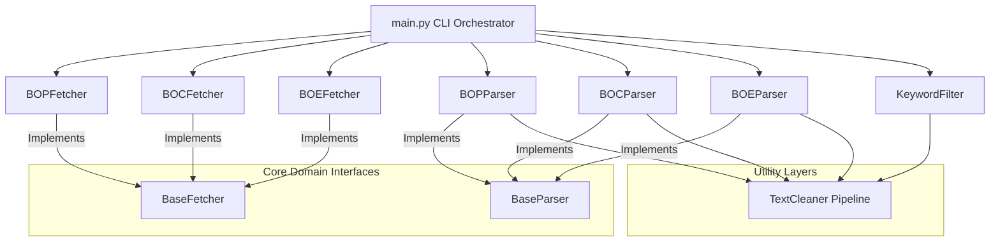

# Boletín Oficial Job Finder CLI Monitor (BOP, BOC & BOE)

[](https://www.python.org/)
[](https://pytest.org/)
[](LICENSE)

An enterprise-grade, clean-architecture command-line tool that monitors the **Official Gazette of the Province of Las Palmas (BOP Las Palmas)**, the **Official Gazette of the Canary Islands (BOC)**, and the **Official Gazette of the Spanish State (BOE)** to automatically identify and extract civil service job openings in the Information Technology and Software Engineering sectors across the entire Spanish territory.

Because official gazettes publish raw, unstructured daily gazettes (monolithic PDF files for BOP, HTML/RSS structures for BOC, and custom Open Data API XML streams for BOE) without clean public APIs, this tool implements a custom high-performance streaming, parsing, and Natural Language Processing (NLP) regex pipeline to isolate and report high-value career opportunities.

---

## 🏗️ Architectural Blueprint

The application is engineered strictly around **Clean Architecture** and the **SOLID principles**, isolating external HTTP dependencies and binary parser implementations behind robust abstract interfaces.



### Key Software Engineering Design Patterns
* **Dependency Inversion**: High-level orchestrators interface exclusively with abstract classes (`BaseFetcher`, `BaseParser`), facilitating seamless transitions to alternative engines without modifying core orchestration logic.
* **Symmetric Merging & Date Filtering**: The BOC integration merges multiple RSS feeds concurrently and applies precise target-date filtering in the fetch phase, converting unstructured feed items into clean in-memory XML buffers.
* **Stateful Stream Processing (Sticky Headers)**: BOP gazettes contain unstructured, multi-page layout flows. The PDF parser utilizes a stateful sticky-header pattern to associate announcements with their respective municipal departments ("organisms") across page breaks.
* **Accent-Insensitive Spanish Search**: Utilizes Unicode NFD normalization and combining-character filtering to achieve 100% robust, accent-insensitive Spanish keyword matching, preventing missing matches due to accent differences (e.g. `informática` vs `informatica`).
* **Two-Step Validation Noise Filtering**: Standard administrative texts are full of false-positive terms (e.g., GDPR "sistemas de datos"). The program runs a two-step validation pipeline:
  1. **Step 1**: Detect target IT root stems.
  2. **Step 2**: Verify the containing block contains employment anchors (e.g., `plaza`, `convocatoria`, `bases`).

---

## 🛠️ Tech Stack & Key Modules

* **Core**: Python 3.11+
* **PDF Extraction**: `pdfplumber` (selected for its precise text-layout extraction and memory-efficient streaming)
* **XML Processing**: `xml.etree.ElementTree` (Standard library)
* **Configuration**: `pyyaml` (allows complete configuration and customization of search criteria)
* **Network & Streaming**: `requests` (streaming chunks enabled)
* **Testing**: `pytest` & `pytest-cov`

---

## ⚙️ Installation

1. **Clone the repository**:
   ```bash
   git clone https://github.com/yourusername/job-finder.git
   cd job-finder
   ```

2. **Install the package in editable mode with development dependencies**:
   ```powershell
   pip install -e ".[dev]"
   ```

---

## 🚀 Usage

The tool exposes two CLI commands: `job-finder` and the newly mapped `bo-finder`.

### 1. Basic Run (Scans Today's BOP, BOC & BOE with Smart Fallback)
Downloads and processes today's BOP PDF, BOC RSS feeds, and BOE XML sumario, and outputs matches.

**Smart Fallbacks**: If today's gazettes are not yet published or it is a weekend/holiday:
* For **BOP**: The tool automatically scrapes the index to find the latest published bulletin.
* For **BOC**: The tool automatically scans feed items to find the most recent active publication date.
* For **BOE**: The tool automatically probes day-by-day backwards up to 7 days from today to download the latest sumario.
```powershell
python -m job_finder.main
```
*(Or simply run the package script entrypoint: `bo-finder`)*

### 2. Scan a Specific Date
Specify a target date in `YYYY-MM-DD` format (which is converted automatically to daily gazette formats):
```powershell
python -m job_finder.main --date 2026-05-21
```

### 3. Filter by Source
Target a specific gazette (`BOP`, `BOC`, `BOE`, or `ALL` - default is `ALL`):
```powershell
python -m job_finder.main --source BOE
```

### 4. Parse a Local File (Offline Mode & Auto-detection)
Skip network requests and analyze a local file directly. The tool automatically detects if the file is a PDF (BOP), a BOC RSS XML file, or a BOE sumario XML file, and routes it to the appropriate parser pipeline:
```powershell
python -m job_finder.main --file tests/fixtures/boe_sample.xml
```

### 5. Custom Keyword Filtering
Pass a custom `keywords.yaml` file to modify IT keywords or employment anchors on the fly:
```powershell
python -m job_finder.main --config path/to/my_keywords.yaml
```

### 6. Optional Gemini AI Validation Layer
The tool includes an optional post-filter step that sends matching candidate announcements to Gemini Flash 3.5 (low reasoning) via the Google AI Studio API for a binary relevance check. This filters out complex Spanish bulletin false positives (e.g. administrative assistant or cleaner positions that mention "informática" in submission boilerplate).

#### Setup:
1. Copy `.env.example` to `.env`:
   ```powershell
   Copy-Item .env.example .env
   ```
2. Add your Google AI Studio API key (get one from [https://aistudio.google.com/apikey](https://aistudio.google.com/apikey)):
   ```env
   GEMINI_API_KEY=your-api-key-here
   ```
   
#### Options & Opting Out:
* By default, if the API key is present in `.env`, AI validation will run automatically.
* **Opting Out**: Use the `--no-ai` flag to disable AI validation completely:
  ```powershell
  python -m job_finder.main --source BOE --no-ai
  ```
* **Graceful Fallback**: If no API key is found or any network/API issue occurs, the system logs a warning in the terminal and automatically falls back to standard regex filtering without crashing.

---

## 🧪 Automated Tests (TDD First)

Following Test-Driven Development (TDD) best practices, the test suite utilizes local PDF and XML fixtures rather than scraping the web during tests. This ensures complete reproducibility and high performance.

### Run Tests:
```powershell
python -m pytest tests/ -v --tb=short
```

---

## 📂 Modular Project Layout

```
job-finder/
├── pyproject.toml             # Standard modern packaging metadata
├── AGENTS.md                  # System & shell constraints for AI coding helpers
├── src/
│   └── job_finder/
│       ├── __init__.py        # Package initialization
│       ├── interfaces.py      # Core interfaces (BaseFetcher, BaseParser, BOPage)
│       ├── bop_fetcher.py     # Streaming BOP PDF downloader
│       ├── bop_parser.py      # Section-bounded pdfplumber parser (BOP)
│       ├── boc_fetcher.py     # Merged RSS downloader (BOC)
│       ├── boc_parser.py      # XML-bounded ElementTree parser (BOC)
│       ├── boe_fetcher.py     # Open Data XML API sumario downloader (BOE)
│       ├── boe_parser.py      # XML-bounded ElementTree parser (BOE)
│       ├── text_cleaner.py    # Unicode, hyphenation, and spacing cleaning
│       ├── keyword_filter.py  # Regex matching + context anchor validation
│       ├── keywords.yaml      # User-editable keyword configuration
│       └── main.py            # CLI entry point (handles terminal UTF-8 encoding)
└── tests/
    ├── conftest.py            # Reusable pytest binary fixtures
    ├── fixtures/
    │   ├── bop_sample.pdf     # Real BOP PDF sample for integration verification
    │   ├── boc_sample.xml     # Synthetic BOC RSS XML sample for verification
    │   └── boe_sample.xml     # Synthetic BOE Sumario XML sample for verification
    ├── test_bop_parser.py     # Domain and integration tests for BOP
    ├── test_boc_parser.py     # Domain and integration tests for BOC
    └── test_boe_parser.py     # Domain and integration tests for BOE
```
