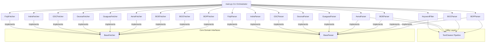

# Job Finder: IT Vacancy Monitor for Official Sources

[](https://www.python.org/)
[](https://pytest.org/)

A Python command-line tool and AWS Lambda workload that monitors BOP Las Palmas, BOC, BOE, Sagulpa, Guaguas Municipales, GEURSA, GSC, Aena, Indra Group, FULP, SODETEGC, EPSO, EURES, and eu-LISA to identify Information Technology and Software Engineering opportunities. SODETEGC is a source-page status monitor; its notices are not confirmed vacancies.

Official sources expose different PDF, HTML, RSS, CSV, JSON, and XML formats. The project uses source-specific fetchers and parsers, shared normalization models, keyword filtering, optional Gemini validation, and Markdown or HTML exports.

> **Project Evolution**: Originally launched as `bop_finder` (focusing solely on the BOP Las Palmas gazette), the project was globally renamed to `job-finder` to accurately reflect its expanded multi-source capabilities across Spanish and European Union databases.

## Documentation

The README is the human-facing introduction. Agent instructions and task-specific context are maintained in [AGENTS.md](AGENTS.md) and the [agent documentation index](docs/index.md). The index routes source work, Lambda operations, testing, configuration, and documentation maintenance to focused Markdown files.

---

## 🏗️ Architectural Blueprint

The application groups source integrations behind shared interface contracts while `main.py` instantiates the concrete fetchers and parsers. The diagram below shows a representative path; the complete source inventory is maintained in [docs/sources/index.md](docs/sources/index.md).


```mermaid
graph TD
    CLI[main.py CLI Orchestrator] --> BOPFetcher[BOPFetcher]
    CLI --> BOCFetcher[BOCFetcher]
    CLI --> BOEFetcher[BOEFetcher]
    CLI --> AenaFetcher[AenaFetcher]
    CLI --> GuaguasFetcher[GuaguasFetcher]
    CLI --> GuaguasParser[GuaguasParser]
    CLI --> GeursaFetcher[GeursaFetcher]
    CLI --> GeursaParser[GeursaParser]
    CLI --> GSCFetcher[GSCFetcher]
    CLI --> GSCParser[GSCParser]
    CLI --> IndraFetcher[IndraFetcher]
    CLI --> IndraParser[IndraParser]
    CLI --> FulpFetcher[FulpFetcher]
    CLI --> FulpParser[FulpParser]
    CLI --> BOPParser[BOPParser]
    CLI --> BOCParser[BOCParser]
    CLI --> BOEParser[BOEParser]
    CLI --> AenaParser[AenaParser]
    CLI --> Filter[KeywordFilter]
    
    subgraph Core Domain Interfaces
        IFetcher[BaseFetcher]
        IParser[BaseParser]
    end
    
    BOPFetcher -- Implements --> IFetcher
    BOCFetcher -- Implements --> IFetcher
    BOEFetcher -- Implements --> IFetcher
    AenaFetcher -- Implements --> IFetcher
    BOPParser -- Implements --> IParser
    BOCParser -- Implements --> IParser
    BOEParser -- Implements --> IParser
    AenaParser -- Implements --> IParser
    GuaguasFetcher -- Implements --> IFetcher
    GuaguasParser -- Implements --> IParser
    GeursaFetcher -- Implements --> IFetcher
    GeursaParser -- Implements --> IParser
    GSCFetcher -- Implements --> IFetcher
    GSCParser -- Implements --> IParser
    IndraFetcher -- Implements --> IFetcher
    IndraParser -- Implements --> IParser
    FulpFetcher -- Implements --> IFetcher
    FulpParser -- Implements --> IParser
    
    subgraph Utility Layers
        Cleaner[TextCleaner Pipeline]
    end
    
    BOPParser --> Cleaner
    BOCParser --> Cleaner
    BOEParser --> Cleaner
    AenaParser --> Cleaner
    Filter --> Cleaner
```

### Key Software Engineering Design Patterns
* **Shared contracts**: `BaseFetcher`/`BaseParser`, the web-board interfaces, and the EU interfaces describe common shapes. The orchestrator still selects concrete classes explicitly in `main.py`.
* **Parallel Source Fetching & Dynamic Buffering**: Uses `ThreadPoolExecutor` in the main orchestrator to scan selected sources concurrently. Console output is buffered through `ThreadLocalStream` for multi-source runs; a single-source run streams progress directly.
* **Deep Multi-Document Ingestion & Targeted Extraction**: Legacy SSR web apps (like Aena) can place job details in supplementary PDF annexes. The scraper selects PDFs whose text or title suggests bases or requirements, processes them concurrently, and catches per-document failures with a title and closing-date fallback when available.
* **Source-Specific Fail-Fast Title Rejection**: Where a source invokes it, the shared title filter evaluates job titles early (before detail pages or attachment downloads) to remove clearly irrelevant roles. Aena applies the absolute and relative title rules; FULP deliberately does not, so its university internships and Programa Inserta offers remain eligible for the shared IT and employment filters.
* **Source-specific date filtering**: Aena can drop listings with an expired closing date before downloading details. Other sources use their own availability rules; a publication date is not automatically an application deadline.
* **Batched AI Validation**: Sends candidates in chunks of 10 to the configured Gemini model, retries selected 429/503 failures with fixed waits, and asks for a Pydantic-validated JSON response. Failed validation keeps candidates.
* **Symmetric Merging & Date Filtering**: The BOC integration merges multiple RSS feeds concurrently and applies precise target-date filtering in the fetch phase, converting unstructured feed items into clean in-memory XML buffers.
* **Stateful Stream Processing (Sticky Headers)**: BOP gazettes contain unstructured, multi-page layout flows. The PDF parser utilizes a stateful sticky-header pattern to associate announcements with their respective municipal departments ("organisms") across page breaks.
* **Accent-Insensitive Spanish Search**: Utilizes Unicode NFD normalization and combining-character filtering for accent-insensitive Spanish keyword matching (e.g. `informática` and `informatica`).
* **Two-Step Validation Noise Filtering**: Standard administrative texts are full of false-positive terms (e.g., GDPR "sistemas de datos"). The program runs a two-step validation pipeline:
  1. **Step 1**: Detect target IT root stems.
  2. **Step 2**: Verify the containing block contains employment anchors (e.g., `plaza`, `convocatoria`, `bases`).

---

## 🛠️ Tech Stack & Key Modules

* **Core**: Python 3.11+
* **PDF Extraction**: `pdfplumber` (selected for its precise text-layout extraction and memory-efficient streaming)
* **XML Processing**: `xml.etree.ElementTree` (Standard library)
* **Configuration**: `pyyaml` (allows complete configuration and customization of search criteria)
* **Network & Streaming**: `requests` (streaming chunks enabled)
* **Testing**: `pytest` & `pytest-cov`

---

## ⚙️ Installation

1. **Clone the repository**:
   ```bash
   git clone https://github.com/alejandroqs/job-finder.git
   cd job-finder
   ```

2. **Install the package in editable mode with development dependencies**:
   ```powershell
   pip install -e ".[dev]"
   ```

---

## 🚀 Usage

The tool exposes two CLI commands: `job-finder` and the newly mapped `bo-finder`.

### 1. Basic Run (Scans the selected sources with smart fallback)
Downloads and processes the selected sources; the default `ALL` group includes all fourteen integrations and outputs findings and source-page notices.

**Smart Fallbacks**: If today's gazettes are not yet published or it is a weekend/holiday:
* For **BOP**: The tool automatically scrapes the index to find the latest published bulletin.
* For **BOC**: The tool automatically scans feed items to find the most recent active publication date.
* For **BOE**: The tool automatically probes day-by-day backwards up to 7 days from today to download the latest sumario.
```powershell
python -m job_finder.main
```
*(Or simply run the package script entrypoint: `bo-finder`)*

### 2. Scan a Specific Date
Specify a target date in `YYYY-MM-DD` format (which is converted automatically to daily gazette formats):
```powershell
python -m job_finder.main --date 2026-05-21
```

### 3. Filter by Source
Target a source or group (`BOP`, `BOC`, `BOE`, `SAGULPA`, `GUAGUAS`, `GEURSA`, `GSC`, `AENA`, `INDRA`, `FULP`, `SODETEGC`, `EPSO`, `EURES`, `EULISA`, `ES`, `EU`, or `ALL`; default is `ALL`):
```powershell
python -m job_finder.main --source BOE
```

### 4. Parse a Local File (Auto-detection)
Provide a local PDF, XML/RSS, HTML, CSV, or JSON file and the tool routes it to the appropriate parser without downloading that source first. Guaguas HTML is detected from its filename or a parser-supported employment container anywhere in the full document, while GEURSA HTML uses a parser-supported active heading plus accordion structure. GSC HTML uses a bounded `gsc` filename token or the parser-supported `#seleccion` plus `.projects_holder.portfolio_main_holder` structure; its parser reads only direct cards in that holder. FULP HTML uses a bounded `fulp` filename token or the parser-supported `.panel_ofertas` listing / `.Content-Oferta` detail structure. Offline FULP details require a canonical or `og:url` identity, while listing snapshots provide listing evidence only and do not fetch details. SODETEGC HTML is routed only when its official employment-page identity and structural signature are present; a filename alone does not select it. Valid unknown-extension HTML can be recognized from the same signature. Generic employment-page phrases or a source mention alone do not provide structural recognition. A local run can still call Gemini for ordinary job findings and send notifications when those integrations are configured; use `--no-ai` and unset notification variables for an isolated parser check:
```powershell
python -m job_finder.main --file tests/fixtures/boe_sample.xml --no-ai
```

GSC reads only direct cards in the current `#seleccion` list holder. It accepts a leading `DD/MM/YYYY` or `DD-MM-YYYY` publication date and monitors the inclusive eight-date window through publication plus seven days; that inferred date is a monitoring heuristic, not an official application deadline. Administrative, result, applicant-list, correction, subsanación, exam/stage, and cancelled notices are excluded before IT filtering. A historical date does not retrieve historical website state, and repeated scans in the same window can repeat findings because there is no persistent cross-run deduplication.

SODETEGC monitors the visible text owned by the `Convocatorias abiertas` section at [`sodetegc.org/conocenos/informacion-administrativa/empleo`](https://www.sodetegc.org/conocenos/informacion-administrativa/empleo/). It compares the whole section with the fixed reference “Actualmente no hay ninguna convocatoria abierta”. A recognized match is silent; a recognized difference produces a source-page notice for manual review, not a confirmed vacancy. Every successful scan while the section differs emits a notice; there is no transition tracking or persistent deduplication. A missing or ambiguous section, invalid page identity, or fetch/parse failure is reported as unverifiable and does not become a notice. `--date` does not retrieve historical page state. SODETEGC notices bypass keyword filtering and Gemini validation.

Indra Group uses the server-rendered `https://careers.indragroup.com/search/` endpoint. By default it performs one blank `q=` search and follows the official pagination links; an optional top-level `portal_search_keywords` list in the selected YAML file deliberately narrows discovery and is independent of the shared include/exclude rules. `#noresults` is authoritative even when the page contains suggestion rows. The source keeps official numeric IDs and clean official URLs, deduplicates before detail retrieval and AI, and applies geographic prefiltering from published structured mode/location evidence. Recognised Portugal or Brazil country components are excluded before `Remote`/`Remoto`, `Indiferente`, or explicit Gran Canaria evidence can admit a job; unknown or unsupported mode/location evidence does not become remote. Offline listing snapshots cannot invent missing modality or fetch details. Accepted jobs then enter the shared IT/employment filter and optional Gemini validation. The [INDRA-only AI prompt preference](docs/configuration.md#gemini-prompt-and-indra-only-preference) covers core SAP, named-platform and dedicated SAST/DAST roles, while incidental tool use and Power BI-focused work remain eligible under the configured instructions. `--no-ai` skips that preference, and failed AI validation retains candidates; live model classification has not been verified. Gemini receives only the first 1,500 characters, and no persistent cross-run deduplication exists. Historical bounded discovery checks had both incomplete and point-in-time complete outcomes; neither proves current catalogue or full detail coverage. Lambda runtime suitability remains unverified.

FULP uses the public [`fulp.es/ofertas`](https://www.fulp.es/ofertas) listing and public numeric detail URLs. It discovers the current response, reconciles its advertised total where present, deduplicates numeric offer IDs, and fetches details serially. Detail identity, redirects, host/path validation, and requests are bounded to the public `www.fulp.es` list/detail paths; the source schedules at most 200 HTTP attempts within a 180-second scheduling budget per scan. It retains ordinary employment, university internship, Programa Inserta Universitario, and Programa Inserta FP Superior types, and does not apply the shared early title-rejection heuristic. `target_date` is used only for explicit application-deadline evidence in the current HTML; it does not reconstruct historical availability. A failed detail is isolated with diagnostics, while incomplete discovery and incomplete detail coverage remain visible to the parser. FULP uses the shared IT/employment filter and optional Gemini stage, receives at most the existing 1,500-character text window, and has no persistent cross-run deduplication. The implementation's live verification was limited to one public listing response and six distinct detail URLs on 2026-09-16; Lambda runtime suitability and current long-term completeness remain unverified.

### 5. Custom Keyword Filtering
Pass a custom `keywords.yaml` file to modify IT keywords or employment anchors on the fly:
```powershell
python -m job_finder.main --config path/to/my_keywords.yaml
```

### 6. Optional Gemini AI Validation Layer
The tool includes an optional post-filter step that sends matching candidate announcements to [Gemini 3.7 Flash](https://ai.google.dev/gemini-api/docs/models/gemini-3.7-flash) (`gemini-3.7-flash`, low reasoning) via the Gemini API for a binary relevance check. This filters out complex Spanish bulletin false positives (e.g. administrative assistant or cleaner positions that mention "informática" in submission boilerplate).

**AI processing details**:
* **Parallel Batching**: Submits up to 10 candidates per request and processes chunks concurrently.
* **Automatic Retries**: Retries selected 429 (Too Many Requests) and 503 (Service Unavailable) failures with fixed waits; failed validation keeps candidates so the scan can continue.
* **Structured Output**: Requests JSON matching the Pydantic `JobOfferValidationBatch` schema. Parsing or API failures fall back to keeping candidates.

#### Setup:
1. Copy `.env.example` to `.env`:
   ```powershell
   Copy-Item .env.example .env
   ```
2. Add your Google AI Studio API key (get one from [https://aistudio.google.com/apikey](https://aistudio.google.com/apikey)):
   ```env
   GEMINI_API_KEY=your-api-key-here
   ```
   
#### Options & Opting Out:
* By default, if the API key is present in `.env`, AI validation will run automatically.
* **Opting Out**: Use the `--no-ai` flag to disable AI validation completely:
  ```powershell
  python -m job_finder.main --source BOE --no-ai
  ```
* **Graceful Fallback**: If no API key is found or any network/API issue occurs, the system logs a warning in the terminal and automatically falls back to standard regex filtering without crashing.

---

## ☁️ Cloud Deployment (AWS Lambda)

The tool supports an AWS Lambda entry point alongside local terminal execution. Each invocation is stateless: date checks reduce obvious repeat processing for selected sources, but the repository has no persistent general-purpose deduplication store. Deployment packages are built in the official AWS SAM Python 3.14 image and transferred through S3.

### Prerequisites

Before deploying, ensure the following prerequisites are met:
* **Docker**: Must be running (with WSL2 integration enabled if you are on Windows).
* **AWS CLI**: Must be installed and authenticated via `aws configure`.
* **S3 Bucket**: An S3 bucket must exist to store the deployment zip (e.g., `job-finder-bucket-muk04-2026`).

### Deployment Script

The following PowerShell deployment script builds Linux-compatible dependencies inside a SAM container, copies the application code, zips the package, uploads it to S3, and updates the AWS Lambda function code. Deployment does not invoke the bot or publish offers:

```powershell
Remove-Item -Recurse -Force -Path ".\dist_lambda" -ErrorAction SilentlyContinue
New-Item -ItemType Directory -Force -Path ".\dist_lambda"

docker run --rm -v "${PWD}:/app" public.ecr.aws/sam/build-python3.14 bash -c "
  mkdir -p /app/dist_lambda/package &&
  dnf install -y libffi-devel &&
  pip install --target /app/dist_lambda/package -r /app/requirements.txt &&
  cp -r /app/src/job_finder /app/dist_lambda/package/ &&
  cd /app/dist_lambda/package &&
  zip -q -r /app/dist_lambda/lambda_function.zip . &&
  rm -rf /app/dist_lambda/package
"

aws s3 cp .\dist_lambda\lambda_function.zip s3://job-finder-bucket-muk04-2026/lambda_function.zip

aws lambda update-function-code `
  --function-name job-finder-bot `
  --s3-bucket job-finder-bucket-muk04-2026 `
  --s3-key lambda_function.zip > $null

aws lambda wait function-updated --function-name job-finder-bot
if ($LASTEXITCODE -ne 0) { throw "Lambda update did not complete successfully." }
```

In your AWS Lambda console, set the handler to **`job_finder.main.lambda_handler`** with a Python 3.14 runtime. Size the function timeout using measured scan duration and the [retry timing constraints](docs/known-limitations.md). A chunk encountering three 429 errors sleeps for 180 seconds in total, before accounting for requests, fetching, parsing, and notifications; a 150-second timeout cannot accommodate that path.

Qualifying pushes to `main` deploy without scanning. For an intentional scan, use **Actions → Manual Production Scan → Run workflow** on `main` and enable `publish_notifications`. This runs the deployed function and sends real offers. Its AWS CLI invocation permits one attempt; a connection failure can still leave Lambda running, so check CloudWatch before rerunning. See [Lambda operations](docs/workflows/lambda-operations.md) for controls and remaining limits.

### Operational Limits & Memory Optimization

Current implementation notes for serverless execution:
* **Temporary storage**: Large PDF files such as BOP bulletins are written to the ephemeral `/tmp/bop_bulletin.pdf` path and cleaned up through the parser's cleanup path. This documents the storage strategy; it does not guarantee a particular memory or runtime outcome.
* **Discord Webhook Limits**: Discord enforces a 6,000-character ceiling across all fields in a single webhook payload. The dispatcher groups embeds into small chunks of **2 announcements** per request to prevent silent HTTP 400 Bad Request rejections.

---


## 🧪 Automated Tests

The test suite uses local PDF, XML, HTML, CSV, and JSON fixtures plus mocked external calls for deterministic cases. It does not prove that live portals, browser dependencies, AWS, or notification services are currently available.

### Run Tests:
```powershell
python -m pytest tests/ -v --tb=short
```

---

## 📂 Representative Project Layout

The following tree shows the main package shape rather than a complete file inventory. Use [docs/sources/index.md](docs/sources/index.md) for all source modules and [docs/testing.md](docs/testing.md) for the complete test groups.
```
job-finder/
├── AGENTS.md, README.md, requirements.txt, pyproject.toml
├── docs/                      # Agent routes, source guides, and workflows
├── src/job_finder/             # CLI, Lambda handler, fetchers, parsers, filters, exporters
└── tests/                      # Fixtures and pytest modules for source families and shared stages
```
