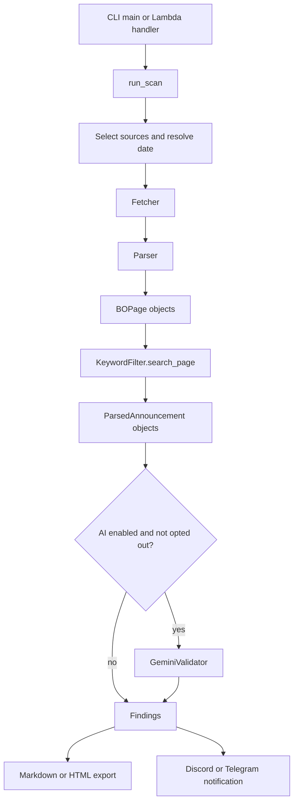

# Architecture and execution flow

Purpose: explain how the scanner moves from an entry point to normalized findings, exports, and notifications.

Read when: tracing execution, changing a source integration, changing filtering or AI validation, or assessing operational impact.

Source of truth: [`main.py`](../src/job_finder/main.py), [`interfaces.py`](../src/job_finder/interfaces.py), the source-specific fetchers and parsers under [`src/job_finder`](../src/job_finder/), [`keyword_filter.py`](../src/job_finder/keyword_filter.py), [`gemini_validator.py`](../src/job_finder/gemini_validator.py), [`html_exporter.py`](../src/job_finder/html_exporter.py), and [`notifier.py`](../src/job_finder/notifier.py).

## Entry points

The local entry point is `job_finder.main:main`, exposed as both `job-finder` and `bo-finder` by `pyproject.toml`. It parses CLI arguments, calls `run_scan`, writes Markdown or HTML findings, prints results, and attempts local notifications when findings exist.

The Lambda entry point is `job_finder.main:lambda_handler`. It reads `sources` and `no_ai` from an event object, calls `run_scan(is_lambda=True)`, and sends Discord or Telegram notifications when findings exist. It returns an HTTP-like status object; the repository does not define the EventBridge schedule itself.

## Common pipeline

`run_scan` supports a local-file path as well as live online scans. Local files are classified by extension or signature and routed to one parser. Online sources are selected individually or by groups: `ES` means BOP, BOC, BOE, Sagulpa, and Aena; `EU` means EPSO, EURES, and eu-LISA; `ALL` means all eight sources.

When more than one online source is selected, source scans run in a `ThreadPoolExecutor`. `ThreadLocalStream` buffers each worker's output and the main thread prints buffers in source order. A single-source scan leaves output unbuffered so long operations can show progress.

## Domain contracts

`BOPage` is the normalized raw page or item passed to filtering. `ParsedAnnouncement` is the normalized finding used by exports, AI validation, and notifications. [`interfaces.py`](../src/job_finder/interfaces.py) defines `BaseFetcher`/`BaseParser` for gazettes, `BaseWebBoardFetcher`/`BaseWebBoardParser` for corporate boards, `BaseEUFetcher`/`BaseEUParser` for European sources, and `BaseAIValidator` for optional AI validation. `main.py` instantiates the concrete classes explicitly; it does not depend exclusively on abstract objects.

`KeywordFilter` applies Spanish accent-insensitive IT matching plus employment anchors to Spanish sources. For dedicated EU portals it uses the configured ESCO-style English IT patterns and bypasses Spanish contest anchors. It also removes configured Spanish boilerplate and provides early title rejection for Aena.

`GeminiValidator` is optional. It deduplicates candidates by URL, sends unique candidates in batches of ten, parses structured JSON, and keeps candidates when the SDK, network, or response validation fails. The exact model and retry delays are implementation details in `gemini_validator.py`; do not describe them as exponential unless the code changes.

## Outputs and side effects

The CLI overwrites the requested findings file. Markdown is the default; an `.html` output path selects HTML automatically. Lambda does not write a persistent findings file as part of `lambda_handler`; it sends configured notifications. Both paths can perform external HTTP requests, and local CLI execution may send notifications if the corresponding environment variables are configured.

The code uses `/tmp` for Lambda-compatible temporary PDFs. Local execution uses the system temporary directory unless `AWS_LAMBDA_FUNCTION_NAME` is set.
