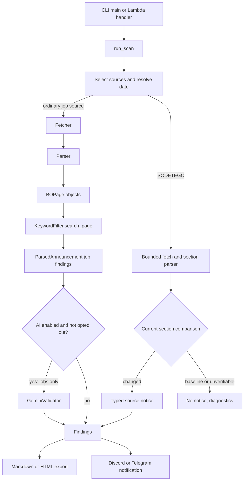

# Architecture and execution flow

Purpose: explain how the scanner moves from an entry point to normalized findings, exports, and notifications.

Read when: tracing execution, changing a source integration, changing filtering or AI validation, or assessing operational impact.

Source of truth: [`main.py`](../src/job_finder/main.py), [`interfaces.py`](../src/job_finder/interfaces.py), the source-specific fetchers and parsers under [`src/job_finder`](../src/job_finder/), [`keyword_filter.py`](../src/job_finder/keyword_filter.py), [`gemini_validator.py`](../src/job_finder/gemini_validator.py), [`html_exporter.py`](../src/job_finder/html_exporter.py), and [`notifier.py`](../src/job_finder/notifier.py).

## Entry points

The local entry point is `job_finder.main:main`, exposed as both `job-finder` and `bo-finder` by `pyproject.toml`. It parses CLI arguments, calls `run_scan`, writes Markdown or HTML findings, prints results, and attempts local notifications when findings exist.

The Lambda entry point is `job_finder.main:lambda_handler`. It reads `sources` and `no_ai` from an event object, calls `run_scan(is_lambda=True)`, and sends Discord or Telegram notifications when findings exist. It returns an HTTP-like status object; the repository does not define the EventBridge schedule itself.

## Common pipeline

`run_scan` supports a local-file path as well as live online scans. Local files are classified by extension or signature and routed to one parser. Guaguas detection reads the full HTML file when the filename is not distinctive and delegates recognition to the parser's supported structural container selectors, so a long header or generic employment-page wording does not misclassify a file. GEURSA detection likewise delegates recognition to the parser's active-heading-plus-accordion signature and rejects a page that only mentions GEURSA. GSC detection delegates structural recognition to `#seleccion` plus its owned `.projects_holder.portfolio_main_holder` holder; a bounded filename token is accepted for explicitly named offline files. Indra detail routing accepts its bounded `.job` fields plus official canonical identity or an explicitly named `indra` file, while the parser still requires a reliable job identity; listing-only snapshots never infer missing modality or fetch details. FULP routing accepts a bounded `fulp` filename token or the parser's bounded `.panel_ofertas`/`.Content-Oferta` signatures; offline detail parsing requires canonical or `og:url` identity, and offline listing pages remain listing-evidence-only. SODETEGC routing requires its official employment-page identity and structural signature, including for unknown-extension HTML; a filename alone does not select it. Online sources are selected individually or by groups: `ES` means BOP, BOC, BOE, Sagulpa, Guaguas, GEURSA, GSC, Aena, Indra, FULP, and SODETEGC; `EU` means EPSO, EURES, and eu-LISA; `ALL` means all fourteen sources.

When more than one online source is selected, source scans run in a `ThreadPoolExecutor`. `ThreadLocalStream` buffers each worker's output and the main thread prints buffers in source order. A single-source scan leaves output unbuffered so long operations can show progress.

## Domain contracts

`BOPage` is the normalized raw page or item passed to filtering. `ParsedAnnouncement` is the normalized finding used by exports, AI validation, and notifications. [`interfaces.py`](../src/job_finder/interfaces.py) defines `BaseFetcher`/`BaseParser` for gazettes, `BaseWebBoardFetcher`/`BaseWebBoardParser` for corporate boards, `BaseEUFetcher`/`BaseEUParser` for European sources, and `BaseAIValidator` for optional AI validation. `main.py` instantiates the concrete classes explicitly; it does not depend exclusively on abstract objects.

`ParsedAnnouncement.kind` defaults to `job`, preserving existing construction and output. `source_notice` marks an application-created status signal with different output wording and no keyword-match claim. SODETEGC does not force a page-state observation into `BOPage`.

`KeywordFilter` applies Spanish accent-insensitive IT matching plus employment anchors to Spanish sources. For dedicated EU portals it uses the configured ESCO-style English IT patterns and bypasses Spanish contest anchors. It also removes configured Spanish boilerplate and provides early title rejection for Aena.

Guaguas is a list-only web-board integration: `GuaguasFetcher` retrieves one HTML document and `GuaguasParser` converts each admitted card directly into one `BOPage`. Main application metadata and bases links are bounded structurally so the `Avisos` section cannot supply application dates, vacancies, positions, or record URLs. Bases links are preserved as record URLs, while PDF contents and the notices history remain outside the normalized text.

GEURSA is also list-only: `GeursaFetcher` makes one list-page request and `GeursaParser` converts only `.x-acc-item` cards bounded by the `Convocatorias en vigor` heading and its nearest semantic owner into `BOPage` objects. An empty semantic owner remains bounded, and each local title, body, control, or attachment belongs only to its nearest `.x-acc-item`; controlled external panels are accepted only inside that active-section range and outside other cards. It retains deadline wording as text without date filtering, excludes the finalized section, removes attachment captions from filter text, and uses the Bases link or the source page as the URL. Its accepted `target_date` parameter does not imply historical retrieval.

GSC is list-only: `GSCFetcher` makes one list-page request and `GSCParser` converts direct articles from the owned `#seleccion` holder into `BOPage` objects. It requires an owned title heading/anchor, parses only a leading two-digit day/month/four-digit-year date with matching separators, applies the inclusive publication-plus-seven-day heuristic, and excludes clearly administrative or cancelled notices before `KeywordFilter`. It emits one paragraph containing the title and distinct publication/inferred-window labels, never downloads details or PDFs, and falls back to the actual list URL when the title anchor is not navigable. It scans the entire bounded holder and does not infer pagination from a generic script include.

Indra is a search/detail integration rather than a category crawler. `IndraFetcher` uses the official `/search/` endpoint with HTTP-client parameters for the chosen locale and exact discovery terms, then follows bounded pagination links. `IndraParser` owns row extraction, no-match recommendation handling, page-cycle/total/safety diagnostics, numeric-ID or canonical-URL deduplication, detail extraction, and the source-local geographic prefilter before producing one `BOPage` per accepted job. Details are fetched at most once per logical job in a run. The default blank search follows the observed full catalogue path; configured `portal_search_keywords` values deliberately narrow discovery and are independent of shared regex filtering. Indra ignores `target_date`, because the portal exposes current vacancies rather than historical retrieval.

Indra's normalized paragraph places source/title, raw location/country, raw and normalized work mode, profile, experience, role, responsibilities, requirements, and relevant description before the shared filter and the unchanged optional Gemini stage. Before that pipeline, Indra rejects exact delimiter-separated country components for Portugal or Brazil, including when an excluded component appears among conflicting or multi-country evidence; non-excluded country conflicts add no new restriction and continue through the existing mode/location policy. Trailing parenthetical annotations do not add countries, and free-form street/client prose is not geocoded. The first filter remains the existing IT-keyword plus employment-anchor path, including title rejection; query terms are not treated as candidate evidence. The second filter still receives at most 1,500 characters and the current prompt is oriented toward Spanish/EU public employment, so it does not establish international contractual eligibility.

FULP is a bounded public list/detail integration. `FulpFetcher` manually validates official-host list/detail URLs and redirect targets, disables automatic redirects, and shares a per-scan scheduling budget of at most 200 HTTP attempts or 180 seconds with serial detail retrieval. `FulpParser` parses `.panel_ofertas` cards and `.Content-Oferta` roots, reconciles advertised totals before availability filtering, deduplicates numeric IDs, keeps discovery and detail completeness separately, and records unsupported continuation, malformed rows, duplicate IDs, detail failures, and unattempted IDs in diagnostics. It preserves the observed offer types and does not invoke the shared early title-rejection heuristic. It uses only explicit application-deadline evidence for `target_date`; publication metadata does not become a deadline, and current HTML cannot reconstruct historical availability.

The FULP detail paragraph preserves owned profile, requirements, tasks, employer, location, contract, working time, vacancies, publication, deadline, summary, and description evidence. Nested foreign cards/roots and controls are excluded, missing employers use the neutral `Empresa no identificada` value, and offline detail identity is quarantined unless canonical or `og:url` metadata is valid and consistent with the numeric path. Accepted FULP pages then enter the same `KeywordFilter.search_page` and optional Gemini stage as the other Spanish sources; no geographic/personal-fit restriction or persistent cross-run deduplication is added.

SODETEGC uses dedicated `SODETEGCFetcher` and `SODETEGCParser` modules. The fetcher requests only the fixed official employment URL with bounded redirects and a 2 MiB body limit. The parser verifies canonical/`og:url` identity plus title and owned page structure, then compares the complete visible `Convocatorias abiertas` section to a fixed Spanish reference. It returns `BASELINE`, `CHANGED`, or `UNVERIFIABLE`, with diagnostic context; hidden page owners make the comparison unverifiable, and the body of a closed `details` element is excluded from visible text. It routes offline files only by the official page signature, never by filename alone. Only `CHANGED` creates a typed source notice. No `BOPage`, shared keyword filtering, or Gemini call is involved. In mixed scans, only ordinary job candidates enter Gemini; notices are retained in original scan order. Every successful scan while the section differs emits a notice, and a later baseline is silent. No persistent state is stored, and `target_date` evaluates the current response rather than historical page state.

`GeminiValidator` is optional. Each input record includes the application-supplied source, and ordinary candidates use source-plus-URL identity; GEURSA and GSC candidates additionally use bounded organism/description fields so distinct source-page or shared-URL records receive independent verdicts. Only `INDRA` activates the [configured AI-stage preference](configuration.md#gemini-prompt-and-indra-only-preference) for core SAP or platform specialisation and dedicated SAST/DAST consulting; incidental tool use and Power BI-focused work remain eligible under that prompt. It sends unique candidates in batches of ten, parses structured JSON, and keeps candidates when the SDK, network, or response validation fails. The exact model and retry delays are implementation details in `gemini_validator.py`; do not describe them as exponential unless the code changes.

## Outputs and side effects

The CLI overwrites the requested findings file. Markdown is the default; an `.html` output path selects HTML automatically. Source notices have separate labels and counts from job findings in console, Markdown, HTML, Discord, Telegram, and Lambda summaries; they link to the official page and do not claim a confirmed vacancy or matched keywords. Lambda does not write a persistent findings file as part of `lambda_handler`; it sends configured notifications. Both paths can perform external HTTP requests, and local CLI execution may send notifications if the corresponding environment variables are configured.

The code uses `/tmp` for Lambda-compatible temporary PDFs. Local execution uses the system temporary directory unless `AWS_LAMBDA_FUNCTION_NAME` is set. Indra does not add persistent storage, reconciliation, scoring, or cross-run identity state; its deduplication ends with the current scan.
